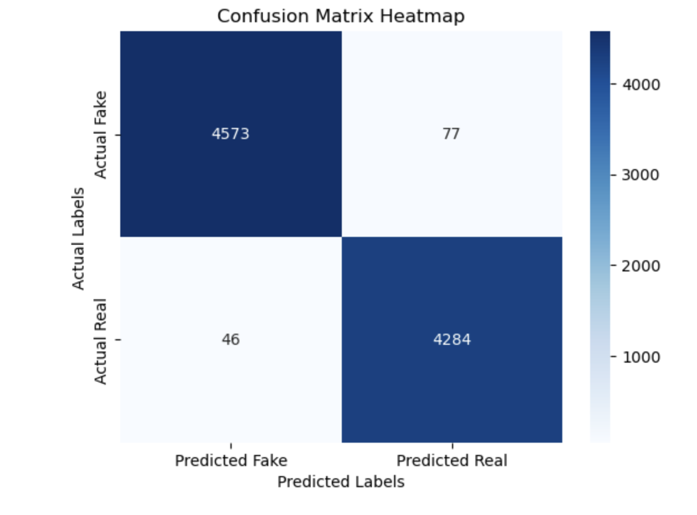

# 📰 Fake News Detection with ISOT Dataset

A beginner-friendly machine learning project to classify news articles as **real** or **fake** using the ISOT Fake News Dataset. Designed and implemented by [Adishree Srikumar](https://www.linkedin.com/in/adishree-s-151085268/).

---

## 🔍 Overview

This repository demonstrates how to build a text classification pipeline in Python with:
- **Data analysis:** Explore and understand the data.
- **Feature engineering:** Text vectorization using TF-IDF.
- **Modeling:** Logistic Regression classifier with scikit-learn.
- **Evaluation:** Accuracy, classification report, and confusion matrix visualization.

---

## 📁 Dataset

- **True.csv:** Real news articles
- **Fake.csv:** Fake news articles

Each file contains: `title`, `text`, `subject`, `date`

Dataset Source: [ISOT Fake News Dataset](https://www.uvic.ca/engineering/ece/isot/datasets/fake-news/index.php)

---

## 🚀 Getting Started

### 1. Clone this repo
git clone https://github.com/adishree951/fake_news_detection.git


cd fake_news_detection

### 2. Install the required packages

pip install pandas matplotlib seaborn scikit-learn

### 3. Run the notebook

Open `notebook.ipynb` in JupyterLab or Jupyter Notebook and run the cells step by step.

---

## 🧪 Project Workflow

1. **Load Data:** Import CSVs using pandas and explore features.
2. **Label & Combine:** Label real/fake, concatenate DataFrames.
3. **Visualization:** Plot class balance with Matplotlib.
4. **Preprocessing:** Vectorize the text using TF-IDF.
5. **Model Training:** Logistic Regression from scikit-learn.
6. **Evaluation:** Print accuracy, show classification report, and plot confusion matrix heatmap.

---

## 📊 Visualizations

### Number of Real vs. Fake News Articles

### Confusion Matrix Heatmap

---

## 🤔 Questions to Explore

- Are data balanced between real and fake?
- Are there missing or duplicate rows?
- Which words are most common in fake vs. real news?
- Does model performance improve with different train/test splits or features?
- Which features were most informative?

---

## 📈 Possible Improvements

- Try additional models (Random Forest, SVM)
- Feature engineering: use article `title`, `subject`, or `date`
- Experiment with advanced text preprocessing (stemming, lemmatization, n-grams)
- Test deep learning models (LSTM, BERT) for further improvement

---

## 📜 License

For educational purposes.  
Dataset by ISOT, University of Victoria.

---

## 🙋 About the Author

Developed by [Adishree Srikumar](https://www.linkedin.com/in/adishree-s-151085268/)  
Feel free to reach out, fork, and contribute!

---

